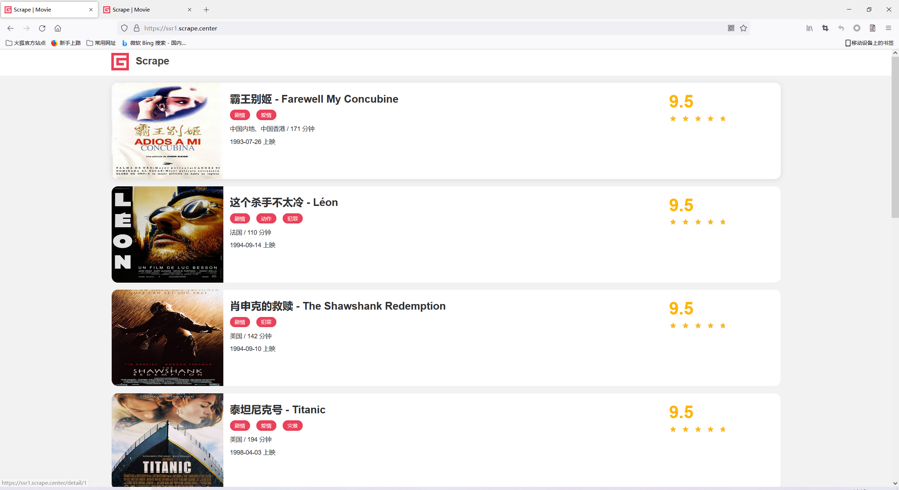
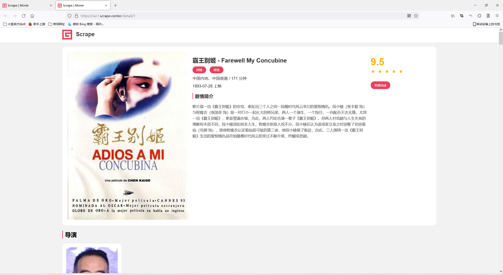
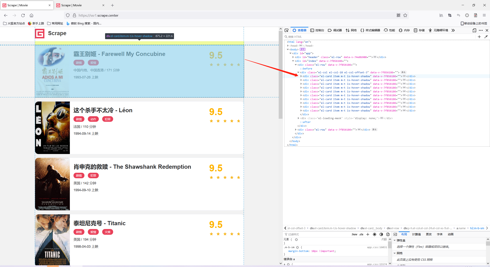
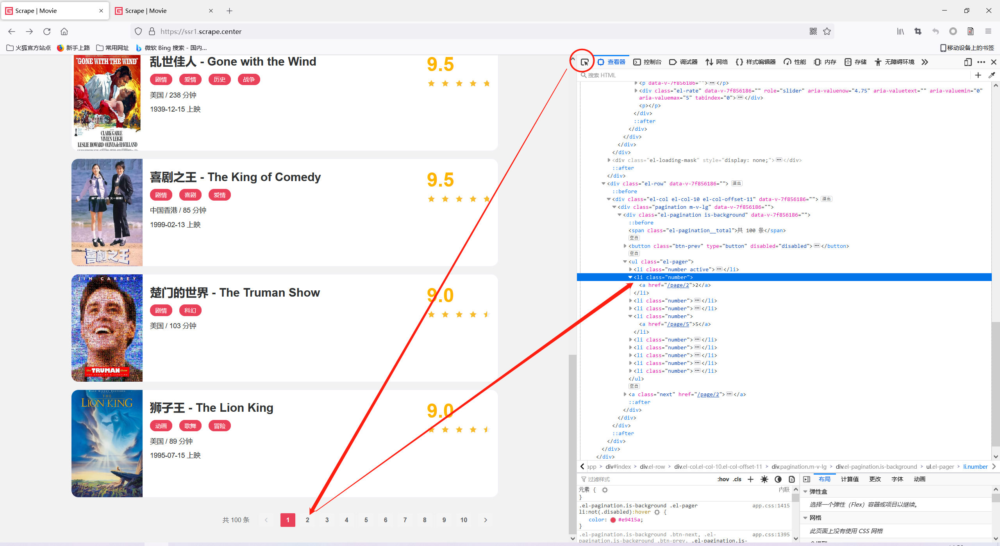
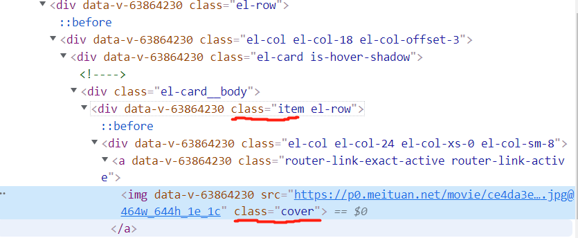
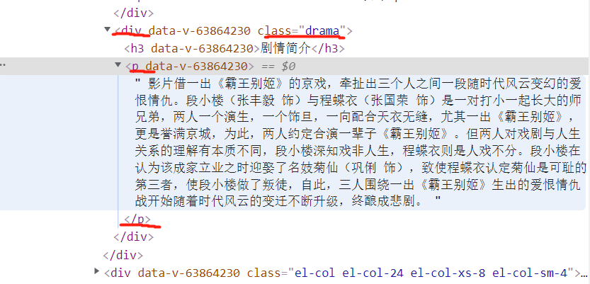
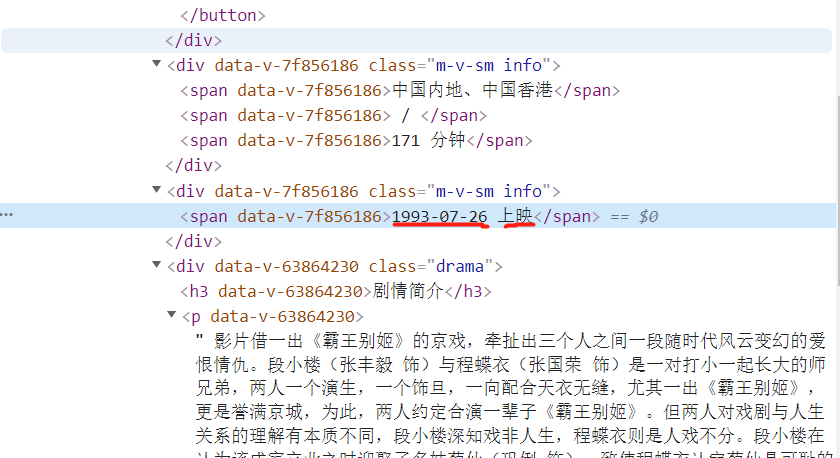

# 基础爬虫案例实战

实现静态网页数据的爬取

## 1.准备工作

- 安装好python3，最低为3.6
- 安装requests库

## 2.爬取目标

以静态网页为案例进行爬取，链接为：

https://ssr1.scrape.center/

这是一个关于电影信息的网站



点击电影标题会进入该电影的详情页



我们这次实战的目标是：

1. 利用requests爬取这个站点每一页的电影列表，顺着列表再爬取每个电影的详情页
2. 用正则表达式提取每部电影的名称、封面、类别、上映时间、评分、剧情简介等内容
3. 把以上爬取的内容保存到MySQL数据库中
4. 使用多进程实现爬取的加速

## 3.爬取列表页

首先我们需要观察列表页的结构和翻页规则，访问https://ssr1.scrape.center/ ，按F12打开浏览器开发者工具，在Elements中我们可以看到网页的html源代码



我们可以看到每一个class为el-card的div标签对应一个电影的页面


鼠标点击开发者工具中的鼠标按钮，在移到点击会跳转进入电影详情页的电影标题位置，可以查看html这部分元素

```html
<a data-v-7f856186="" href="/detail/1" class="name">
	<h2 data-v-7f856186="" class="m-b-sm">霸王别姬 - Farewell My Concubine</h2>
</a>
```

我们可以看到这对应的是一个a标签而且带有href属性，这是一个超链接，其中href的值是/detail/1，这是一个相对于网站根目录https://ssr1.scrape.center/的路径，因此点击这个a标签就会跳转到https://ssr1.scrape.center/detail/1，再看看详情页对应的url也是https://ssr1.scrape.center/detail/1

多观察多几个条目，我们发现电影详情页的url都是https://ssr1.scrape.center/detail/+数字 这种规律


接下来我们找翻页的逻辑



在翻页处故技重施，我们知道翻页对应的超链接就是

https://ssr1.scrape.center/page/+页数 这种套路

总结：

我们知道了访问所有页面的逻辑

访问不同的分页

https://ssr1.scrape.center/page/+页数

访问电影详情页

https://ssr1.scrape.center/detail/+数字


## 4.代码实现

### 4.1列表页的爬取

完成列表页的爬取，可以按这两个步骤来实现

1. 遍历所有页码，构造10页的索引页URL
2. 从每个索引页，分析提取每个电影的详情页URL

代码如下：

```python
import requests
import logging
import re
from urllib.parse import urljoin


'''
定义基础变量
设置日志等级和日志格式
'''
logging.basicConfig(level=logging.INFO, format='%(asctime)s - %(levelname)s: %(message)s')

BASE_URL = 'https://ssr1.scrape.center'
TOTAL_PAGE = 10

'''
判断状态码是否是200，如果是，直接返回页面的HTML代码，如果不是，则输出错误日志信息
同时实现了requests库的异常处理，在logging库中error方法里设置了exc_info=True，可以打印出Traceback错误堆栈信息
'''
def scrape_page(url):
    logging.info('scraping %s...', url)
    try:
        response = requests.get(url)
        if response.status_code == 200:
            return response.text
        # 创建一条严重级别为ERROR的日志记录
        logging.error('get invalid status code %s while scraping %s', response.status_code, url)
    except requests.RequestException:
        #创建一条严重级别为ERROR的日志记录
        logging.error('error occurred while scraping %s', url, exc_info=True)

'''
接收page参数，实现列表页URL拼接，同时调用scrape_page()函数实现页面爬取
'''
def scrape_index(page):
    index_url = f'{BASE_URL}/page/{page}'
    return scrape_page(index_url)

'''
我们先前指导知道a标签里面的href属性与网站的根目录拼接正好是电影详情页的url
因此我们用正则把所有a标签的href属性找出来
<a.*?href="(.*?)".*?class="name">
.*?是非贪婪匹配任意字符，也就是找上面那种格式中()内的内容
使用re.findall()找到html内所有匹配的值
这里函数的结尾使用了yield，使得函数变成一个对象，一个迭代器
'''
def parse_index(html):
    pattern = re.compile('<a.*?href="(.*?)".*?class="name">')
    items = re.findall(pattern, html)
    if not items:
        return []
    for item in items:
        detail_url = urljoin(BASE_URL, item)
        logging.info('get detail url %s', detail_url)
        yield detail_url

'''
根据TOTAL_PAGE进行遍历，logging.info()输出详情页
'''
def main():
    for page in range(1, TOTAL_PAGE + 1):
        index_html = scrape_index(page)
        detail_urls = parse_index(index_html)
        logging.info('detail urls %s', list(detail_urls))

if __name__ == '__main__':
    main()
```

### 4.2详情页爬取

首先我们打开第一个详情页https://ssr1.scrape.center/detail/1

老规矩F12查看源码

先确定我们要爬取的内容

鼠标点击


然后移到想要爬取的内容，单击可查看源码

封面：



```html
它的正则表达式：
class="item.*?
```


电影名称：

```html
<h2 data-v-63864230="" class="m-b-sm">霸王别姬 - Farewell My Concubine</h2>

它的正则表达式：
<h2.*?class="m-b-sm">(.*?)</h2>
```


类别：


```
它的正则表达式：
<button.*?category.*?<span>(.*?)</span>
```

上映时间：



```
它的正则表达式：
(\d{4}-\d{2}-\d{2})\s?上映)
```

评分：

```
<p data-v-63864230="" class="score m-t-md m-b-n-sm">9.5</p>

它的正则表达式：
<p.*?class="score m-t-md m-b-n-sm">(.*?)</p>
```

剧情简介：



```
它的正则表达式：
<div.*?class="drama".*?<p.*?>(.*?)</p>
```


根据对应数据的正则表达式，我们返回数据字典

```python
'''
获取html页面
'''
def scrape_detail(url):
    return scrape_page(url)

'''
根据正则表达式提取所需数据
返回数据字典
'''
def parse_detail(html):
    cover_pattern = re.compile('class="router-link.*?', re.S)
    cover = re.search(cover_pattern, html).group(1).strip() if re.search(cover_pattern, html) else None

    name_pattern = re.compile('<h2.*?class="m-b-sm">(.*?)</h2>')
    name = re.search(name_pattern, html).group(1).strip() if re.search(name_pattern, html) else None

    categories_pattern = re.compile('<button.*?category.*?<span>(.*?)</span>', re.S)
    categories = re.findall(categories_pattern, html) if re.findall(categories_pattern, html) else []

    published_at_pattern = re.compile('(\d{4}-\d{2}-\d{2})\s?上映')
    published_at = re.search(published_at_pattern, html).group(1).strip() if re.search(published_at_pattern, html) else None

    drama_pattern = re.compile('<div.*?class="drama".*?<p.*?>(.*?)</p>', re.S)
    drama = re.search(drama_pattern, html).group(1).strip() if re.search(drama_pattern, html) else None

    score_pattern = re.compile('<p.*?score.*?>(.*?)</p>', re.S)
    score = re.search(score_pattern, html).group(1).strip() if re.search(score_pattern, html) else None

    return {
        'cover': cover,
        'name': name,
        'categroies': categories,
        'published_at': published_at,
        'drama': drama,
        'score': score
    }

'''
根据TOTAL_PAGE进行遍历，logging.info()输出数据
'''
def main():
    for page in range(1, TOTAL_PAGE + 1):
        index_html = scrape_index(page)
        detail_urls = parse_index(index_html)
        for detail_url in detail_urls:
            detail_html = scrape_detail(detail_url)
            data = parse_detail(detail_html)
            logging.info('get detail data %s', data)


if __name__ == '__main__':
    main()
```


### 4.3使数据插入Mysql数据库

现在改造一下，使得爬虫的数据插入数据库

```python
import pymysql
'''
0、本地mysql建立cui_spider数据库
1、连接本地数据库
2、建立游标
'''
def connectDB():
    dbhost = "127.0.0.1"
    dbName = "cui_spider"
    dbuser = "your mysql username"
    dbpassword = "your mysql password"
    # 此处添加charset='utf8'是为了在数据库中显示中文，此编码必须与数据库的编码一致
    db = pymysql.connect(host=dbhost, user=dbuser, password=dbpassword, database = dbName, charset='utf8')
    return db

'''
创建电影表
'''
def create_table():
    cursor = connectDB().cursor()
    #如果存在student表，则删除
    cursor.execute("DROP TABLE IF EXISTS movie")

    #创建student表
    sql = """
        create table movie(
        cover varchar(256),
        name varchar(256),
        categories varchar(256),
        published_at varchar(256),
        drama varchar(1024),
        score varchar(10));
    """

    try:
        # 执行SQL语句
        cursor.execute(sql)
        print("创建电影表成功")
    except Exception as e:
        print("创建电影表失败：case%s"%e)

'''
写一个插入函数
'''
def insert_function(cover, name, categories, published_at, drama, score):
    DB_insert = connectDB()
    cursor_insert = DB_insert.cursor()
    insert_sql = 'insert into movie (cover, name, categories, published_at, drama, score)values(%s, %s, %s, %s, %s, %s)'
    cursor_insert.execute(insert_sql, (cover, name, categories, published_at, drama, score))
    DB_insert.commit()
    DB_insert.close()


'''
根据TOTAL_PAGE进行遍历，logging.info()输出数据
'''
def main():
    create_table()
    for page in range(1, TOTAL_PAGE + 1):
        index_html = scrape_index(page)
        detail_urls = parse_index(index_html)
        for detail_url in detail_urls:
            detail_html = scrape_detail(detail_url)
            data = parse_detail(detail_html)
            insert_function(data['cover'], data['name'], data['categories'], data['published_at'], data['drama'], data['score'])
            logging.info('get detail data %s', data)
        # logging.info('detail urls %s', list(detail_urls))

if __name__ == '__main__':
    main()
```


### 4.4使用多进程

完整代码

```python
import requests
import logging
import re
from urllib.parse import urljoin
import pymysql


'''
定义基础变量
设置日志等级和日志格式
'''
logging.basicConfig(level=logging.INFO, format='%(asctime)s - %(levelname)s: %(message)s')

BASE_URL = 'https://ssr1.scrape.center'
TOTAL_PAGE = 10

'''
判断状态码是否是200，如果是，直接返回页面的HTML代码，如果不是，则输出错误日志信息
同时实现了requests库的异常处理，在logging库中error方法里设置了exc_info=True，可以打印出Traceback错误堆栈信息
'''
def scrape_page(url):
    logging.info('scraping %s...', url)
    try:
        response = requests.get(url)
        if response.status_code == 200:
            return response.text
        # 创建一条严重级别为ERROR的日志记录
        logging.error('get invalid status code %s while scraping %s', response.status_code, url)
    except requests.RequestException:
        #创建一条严重级别为ERROR的日志记录
        logging.error('error occurred while scraping %s', url, exc_info=True)

'''
接收page参数，实现列表页URL拼接，同时调用scrape_page()函数实现页面爬取
'''
def scrape_index(page):
    index_url = f'{BASE_URL}/page/{page}'
    return scrape_page(index_url)

'''
我们先前指导知道a标签里面的href属性与网站的根目录拼接正好是电影详情页的url
因此我们用正则把所有a标签的href属性找出来
<a.*?href="(.*?)".*?class="name">
.*?是非贪婪匹配任意字符，也就是找上面那种格式中()内的内容
使用re.findall()找到html内所有匹配的值
这里函数的结尾使用了yield，使得函数变成一个对象，一个迭代器
'''
def parse_index(html):
    pattern = re.compile('<a.*?href="(.*?)".*?class="name">')
    items = re.findall(pattern, html)
    if not items:
        return []
    for item in items:
        detail_url = urljoin(BASE_URL, item)
        logging.info('get detail url %s', detail_url)
        yield detail_url

'''
获取html页面
'''
def scrape_detail(url):
    return scrape_page(url)

'''
根据正则表达式提取所需数据
返回数据字典
'''
def parse_detail(html):
    cover_pattern = re.compile('class="item.*?', re.S)
    cover = re.search(cover_pattern, html).group(1).strip() if re.search(cover_pattern, html) else None

    name_pattern = re.compile('<h2.*?class="m-b-sm">(.*?)</h2>')
    name = re.search(name_pattern, html).group(1).strip() if re.search(name_pattern, html) else None

    categories_pattern = re.compile('<button.*?category.*?<span>(.*?)</span>', re.S)
    categories = re.findall(categories_pattern, html) if re.findall(categories_pattern, html) else []

    published_at_pattern = re.compile('(\d{4}-\d{2}-\d{2})\s?上映')
    published_at = re.search(published_at_pattern, html).group(1).strip() if re.search(published_at_pattern, html) else None

    drama_pattern = re.compile('<div.*?class="drama".*?<p.*?>(.*?)</p>', re.S)
    drama = re.search(drama_pattern, html).group(1).strip() if re.search(drama_pattern, html) else None

    score_pattern = re.compile('<p.*?score.*?>(.*?)</p>', re.S)
    score = re.search(score_pattern, html).group(1).strip() if re.search(score_pattern, html) else None

    return {
        'cover': cover,
        'name': name,
        'categories': str(categories),
        'published_at': published_at,
        'drama': drama,
        'score': score
    }

'''
0、本地mysql建立cui_spider数据库
1、连接本地数据库
2、建立游标
'''
def connectDB():
    dbhost = "127.0.0.1"
    dbName = "cui_spider"
    dbuser = "your mysql username"
    dbpassword = "your mysql password"
    # 此处添加charset='utf8'是为了在数据库中显示中文，此编码必须与数据库的编码一致
    db = pymysql.connect(host=dbhost, user=dbuser, password=dbpassword, database = dbName, charset='utf8')
    return db

'''
创建电影表
'''
def create_table():
    cursor = connectDB().cursor()
    #如果存在student表，则删除
    cursor.execute("DROP TABLE IF EXISTS movie")

    #创建student表
    sql = """
        create table movie(
        cover varchar(256),
        name varchar(256),
        categories varchar(256),
        published_at varchar(256),
        drama varchar(2048),
        score varchar(10));
    """

    try:
        # 执行SQL语句
        cursor.execute(sql)
        print("创建电影表成功")
    except Exception as e:
        print("创建电影表失败：case%s"%e)

'''
写一个插入函数
'''
def insert_function(cover, name, categories, published_at, drama, score):
    DB_insert = connectDB()
    cursor_insert = DB_insert.cursor()
    insert_sql = 'insert into movie (cover, name, categories, published_at, drama, score)values(%s, %s, %s, %s, %s, %s)'
    cursor_insert.execute(insert_sql, (cover, name, categories, published_at, drama, score))
    DB_insert.commit()
    DB_insert.close()


'''
根据TOTAL_PAGE进行遍历，logging.info()输出数据
'''
def main():
    create_table()
    for page in range(1, TOTAL_PAGE + 1):
        index_html = scrape_index(page)
        detail_urls = parse_index(index_html)
        for detail_url in detail_urls:
            detail_html = scrape_detail(detail_url)
            data = parse_detail(detail_html)
            insert_function(data['cover'], data['name'], data['categories'], data['published_at'], data['drama'], data['score'])
            logging.info('get detail data %s', data)
        # logging.info('detail urls %s', list(detail_urls))

if __name__ == '__main__':
    main()
```

这个基本不会报错


使用多进程版本

```python
import requests
import logging
import re
from urllib.parse import urljoin
import pymysql
import multiprocessing


'''
定义基础变量
设置日志等级和日志格式
'''
logging.basicConfig(level=logging.INFO, format='%(asctime)s - %(levelname)s: %(message)s')

BASE_URL = 'https://ssr1.scrape.center'
TOTAL_PAGE = 10

'''
判断状态码是否是200，如果是，直接返回页面的HTML代码，如果不是，则输出错误日志信息
同时实现了requests库的异常处理，在logging库中error方法里设置了exc_info=True，可以打印出Traceback错误堆栈信息
'''
def scrape_page(url):
    logging.info('scraping %s...', url)
    try:
        response = requests.get(url)
        if response.status_code == 200:
            return response.text
        # 创建一条严重级别为ERROR的日志记录
        logging.error('get invalid status code %s while scraping %s', response.status_code, url)
    except requests.RequestException:
        #创建一条严重级别为ERROR的日志记录
        logging.error('error occurred while scraping %s', url, exc_info=True)

'''
接收page参数，实现列表页URL拼接，同时调用scrape_page()函数实现页面爬取
'''
def scrape_index(page):
    index_url = f'{BASE_URL}/page/{page}'
    return scrape_page(index_url)

'''
我们先前指导知道a标签里面的href属性与网站的根目录拼接正好是电影详情页的url
因此我们用正则把所有a标签的href属性找出来
<a.*?href="(.*?)".*?class="name">
.*?是非贪婪匹配任意字符，也就是找上面那种格式中()内的内容
使用re.findall()找到html内所有匹配的值
这里函数的结尾使用了yield，使得函数变成一个对象，一个迭代器
'''
def parse_index(html):
    pattern = re.compile('<a.*?href="(.*?)".*?class="name">')
    items = re.findall(pattern, html)
    if not items:
        return []
    for item in items:
        detail_url = urljoin(BASE_URL, item)
        logging.info('get detail url %s', detail_url)
        yield detail_url

'''
获取html页面
'''
def scrape_detail(url):
    return scrape_page(url)

'''
根据正则表达式提取所需数据
返回数据字典
'''
def parse_detail(html):
    cover_pattern = re.compile('class="item.*?', re.S)
    cover = re.search(cover_pattern, html).group(1).strip() if re.search(cover_pattern, html) else None

    name_pattern = re.compile('<h2.*?class="m-b-sm">(.*?)</h2>')
    name = re.search(name_pattern, html).group(1).strip() if re.search(name_pattern, html) else None

    categories_pattern = re.compile('<button.*?category.*?<span>(.*?)</span>', re.S)
    categories = re.findall(categories_pattern, html) if re.findall(categories_pattern, html) else []

    published_at_pattern = re.compile('(\d{4}-\d{2}-\d{2})\s?上映')
    published_at = re.search(published_at_pattern, html).group(1).strip() if re.search(published_at_pattern, html) else None

    drama_pattern = re.compile('<div.*?class="drama".*?<p.*?>(.*?)</p>', re.S)
    drama = re.search(drama_pattern, html).group(1).strip() if re.search(drama_pattern, html) else None

    score_pattern = re.compile('<p.*?score.*?>(.*?)</p>', re.S)
    score = re.search(score_pattern, html).group(1).strip() if re.search(score_pattern, html) else None

    return {
        'cover': cover,
        'name': name,
        'categories': str(categories),
        'published_at': published_at,
        'drama': drama,
        'score': score
    }

'''
0、本地mysql建立cui_spider数据库
1、连接本地数据库
2、建立游标
'''
def connectDB():
    dbhost = "127.0.0.1"
    dbName = "cui_spider"
    dbuser = "your mysql username"
    dbpassword = "your mysql password"
    # 此处添加charset='utf8'是为了在数据库中显示中文，此编码必须与数据库的编码一致
    db = pymysql.connect(host=dbhost, user=dbuser, password=dbpassword, database = dbName, charset='utf8')
    return db

'''
创建电影表
'''
def create_table():
    cursor = connectDB().cursor()
    #如果存在student表，则删除
    cursor.execute("DROP TABLE IF EXISTS movie")

    #创建student表
    sql = """
        create table movie(
        cover varchar(256),
        name varchar(256),
        categories varchar(256),
        published_at varchar(256),
        drama varchar(2048),
        score varchar(10));
    """

    try:
        # 执行SQL语句
        cursor.execute(sql)
        print("创建电影表成功")
    except Exception as e:
        print("创建电影表失败：case%s"%e)

'''
写一个插入函数
'''
def insert_function(cover, name, categories, published_at, drama, score):
    DB_insert = connectDB()
    cursor_insert = DB_insert.cursor()
    insert_sql = 'insert into movie (cover, name, categories, published_at, drama, score)values(%s, %s, %s, %s, %s, %s)'
    cursor_insert.execute(insert_sql, (cover, name, categories, published_at, drama, score))
    DB_insert.commit()
    DB_insert.close()


'''
根据TOTAL_PAGE进行遍历，logging.info()输出数据
'''
def main(page):
    index_html = scrape_index(page)
    detail_urls = parse_index(index_html)
    for detail_url in detail_urls:
        detail_html = scrape_detail(detail_url)
        data = parse_detail(detail_html)
        insert_function(data['cover'], data['name'], data['categories'], data['published_at'], data['drama'], data['score'])
        logging.info('get detail data %s', data)

if __name__ == '__main__':
    create_table()
    pool = multiprocessing.Pool()
    pages = range(1, TOTAL_PAGE + 1)
    pool.map(main, pages)
    pool.close()
    pool.join()
```

虽然多进程的话快一点，但是这个会有报错的情况