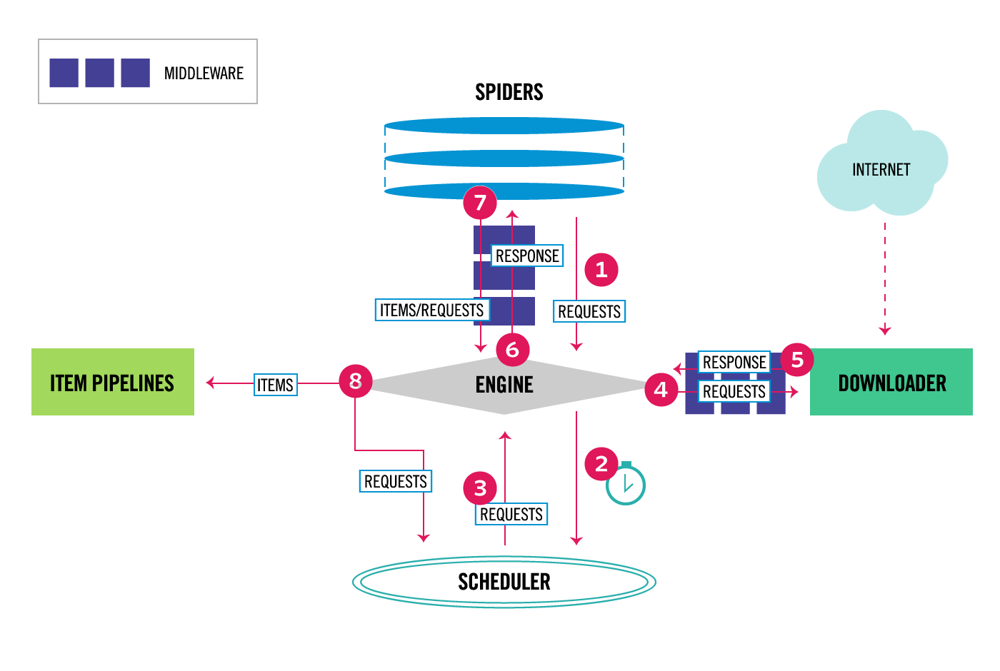

# 3.1 Scrapy框架介绍

&emsp;&emsp;
经过前面的学习，相信你已经掌握了网络爬虫的部分技术，并能根据自己的需求去爬一些简单的网站。接下来，我将为小伙伴们介绍一个爬虫框架，它非常成熟、强大、稳定。它的名字就是 **Scrapy**。

## 3.1.1 Scrapy简介

&emsp;&emsp;
Scrapy是一个基于python
编写的爬虫框架。它应用广泛，可以应用在数据挖掘、信息处理或存储数据等一系列的程序中。它非常灵活，我们可以根据自己的需求进行改写来实现想要的功能。因此，我们在学习中需要好好掌握 Scrapy 框架。学习Scrapy 后,我相信你会更加惊叹 Scrapy 的强大。接下来，让我们来一起学习下 Scrapy 框架吧！！！

## 3.1.2 Scrapy框架组成

&emsp;&emsp;我们认识一个框架，应该先分别了解每个组成和功能。就像医学中，为了解人体生命活动规律，我们也是从每个系统开始了解。那么，我们就先了解下Scrapy的每个组件和功能吧！

&emsp;&emsp;首先我们先看下Scrapy官方文档给出的图.

&emsp;&emsp;
我当初看到这图时，我也是感觉头大，不知道从何下手。不过，小伙伴不要害怕。经过学习后，我们都会理解的。下面我将为大家一一介绍。

- ENGINE(引擎)：它在框架中，负责Spider、ItemPipeline、Downloader、Scheduler 中间的通讯，信号、数据传递等。类似于我们的大脑，调控着身体的运动和功能。
- SCHEDULER(调度器)：它负责接受 ENGINE 发送过来的Request请求，并将它们加入到队列中，以便 ENGINE 请求时发送给引擎。 
- SPIDERS(蜘蛛)：它负责处理所有 Responses,从中分析提取数据，获取Item字段需要的数据，并将需要跟进的 URL 提交给引擎，再次进入 Scheduler (调度器)。
- ITEM PIPELINES(管道)：它负责处理 Spider 中获取到的 Item，并进行进行后期处理（详细分析、过滤、存储等）的地方。
- DOWNLOADER(下载器)：它负责下载 Scrapy Engine发送的所有Requests请求，并将其获取到的 Responses 交还给Scrapy Engine，由引擎交给Spider来处理。
- MIDDLEWARE(中间件)：
  - Spider Middleware(爬虫中间件)
    :一个可以自定义扩展下载功能的组件。它负责处理 SPIDER 输出给ENGINE的 Requests 和 Items,也负责处理ENGINE输出给 SPIDERS 的 Response。
  - Download Middleware(下载中间件)：一个可以自定扩展和操作 ENGINE 和 Spider中间通信的功能组件。它负责处理从 ENGINE 到 DOWNLOADER 之间的 Requests和从 DOWNLOADER 到 ENGINE 之间的 Response。

&emsp;&emsp;
上面就是 Scrapy 框架的的组成部件，具体的用法我们就不再这里介绍了。后面的章节会为大家详细介绍。既然我们知道了Scrapy 框架的组成，那我们应该去了解 Scrapy 框架的数据流是如何运行的了。

## 3.1.3 数据流
&emsp;&emsp;
下面，将为大家阐述Scrapy框架的数据流运行的过程，以便大家更好地理解。整个数据流分为九个步骤，下面将按顺序列出。

&emsp;&emsp;&emsp;&emsp;1.SPIDER(蜘蛛)将初始爬取请求传递给引擎。

&emsp;&emsp;&emsp;&emsp;2.引擎将请求传递给调度器，并索取下一个请求去爬取。

&emsp;&emsp;&emsp;&emsp;3.调度器将根据调度逻辑将请求传递给引擎。

&emsp;&emsp;&emsp;&emsp;4.引擎将调度器发来的请求经过下载中间件传递给下载器。

&emsp;&emsp;&emsp;&emsp;5.下载器向服务器端发起请求，获得响应。然后将响应通过下载中间件传递给引擎。

&emsp;&emsp;&emsp;&emsp;6.引擎收到响应后，经过爬虫中间件将其传递给SPIDER（蜘蛛），进行解析、处理。

&emsp;&emsp;&emsp;&emsp;7.SPIDER处理响应，根据指定的需求返回Item和新的请求，并经过爬虫中间件传递给引擎。

&emsp;&emsp;&emsp;&emsp;8.引擎将获取到的Item传递给管道，将新的请求传递给调度器，等待下一次被调度。

&emsp;&emsp;&emsp;&emsp;9.从步骤一开始重复上述过程，只到调度器中不再有新的请求。

&emsp;&emsp;
以上便是一个用Scrapy
框架编写的爬虫程序的运行逻辑，虽然看似复杂，但这些只要我们理解就行了。理解这些过程，有助于我们代码的编写。希望小伙伴们对照流程图多多复述几遍！！具体的代码编写，我们在后面章节中学到。

## 3.1.4小节
&emsp;&emsp;本小节，我们学习了Scrapy框架的架构，整个框架的运行过程。这些对于使用Scrapy
框架是重要的！希望小伙伴好好理解！！！

------

- 参考内容：
  - 《python3网络爬虫开发实战》
  - Scrapy官方文档
  - 百度百科上Scrapy介绍